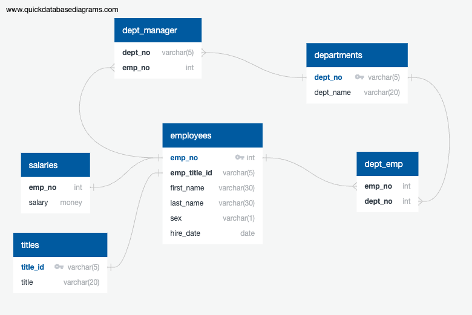

# sql-challenge
Module 6 submission for UC Berkeley data science bootcamp.

This project structures and analyzes data pertaining to employee records of a theoretical company from the 1980s and 1990s. The salient information has been retained only in a series of six `.csv` files to which we have been granted access.

For this project, we have instnatiated a relational database, designed a schema to hold the employee data, populated the data tables, and then answered a series of salient questions that the C-suite has about employment during this window. The components of this project are laid out in more detail below.

---

## Data Modeling

### Procedure
Inspect the `.csv` files and sketch an entity relationship diagram (ERD) of the tables.

    * The files `dm-01-employee_sql_erd.png` and `dm-02-table_schema.pdf` contain relevant ERD information.

---

## Data Engineering

### Procedure
1. Use the provided information to create a table schema for each of the six CSV files. Be sure to do the following:

    * Specify the data types, primary keys, foreign keys, and other constraints.

    * For the primary keys, verify that the column is unique. Otherwise, create a composite keyLinks to an external site., which takes two primary keys to uniquely identify a row.

    * Be sure to create the tables in the correct order to handle the foreign keys.

2. Import each CSV file into its corresponding SQL table.

The files labeled `de-01-create_database.sql`, `de-02-create_tables.sql` and `EmployeeSQL/de-02-create_tables.sql` contain all critical information pertaining to the construction of our database and tables. The schema is clearly outlined both in these files and in the files referenced by the `Data Modeling` section.

---

## Data Analysis
A summary file of all relevant SQL queries is included under `all_queries.sql`. Individual query and results files are also provided, as described below.

1. List the employee number, last name, first name, sex, and salary of each employee.
    - The query script is called `da-01-employee_info_query.sql`.
    - The results file is called `da-01-employee_info_query_results.csv`.

2. List the first name, last name, and hire date for the employees who were hired in 1986.
    - The query script is called `da-02_hired_1986_query.sql`.
    - The results file is called `da-02_hired_1986_query._results.csv`.

3. List the manager of each department along with their department number, department name, employee number, last name, and first name.
    - The query script is called `da-03-manager_query.sql`.
    - The results file is called `da-03-manager_query_results.csv`.

4. List the department number for each employee along with that employee’s employee number, last name, first name, and department name.
    - The query script is called `da-04-employees_with_department_query.sql`.
    - The results file is called `da-04-employees_with_department_query_results.csv`.

5. List first name, last name, and sex of each employee whose first name is Hercules and whose last name begins with the letter B.
    - The query script is called `da-05-hercules_b_query.sql`.
    - The results file is called `da-05-hercules_b_query_results.csv`.

6. List each employee in the Sales department, including their employee number, last name, and first name.
    - The query script is called `da-06-sales_employees_query.sql`.
    - The results file is called `da-06-sales_employees_query_results.csv`.

7. List each employee in the Sales and Development departments, including their employee number, last name, first name, and department name.
    - The query script is called `da-07-sales_dev_employees_query.sql`.
    - The results file is called `da-07-sales_dev_employees_query_results.csv`.

8. List the frequency counts, in descending order, of all the employee last names (that is, how many employees share each last name).
    - The query script is called `da-08-surname_frequency_query.sql`.
    - The results file is called `da-08-surname_frequency_query_results.csv`.